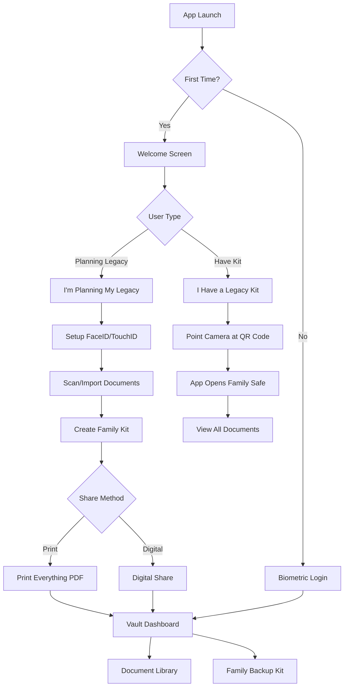

## 1. Product Overview

**After Me** is a secure, local-first digital vault application designed for end-of-life planning. Unlike cloud-based solutions, all documents are encrypted and stored locally on the device, ensuring complete privacy and zero-knowledge architecture. The app solves the critical problem of document access after death through its "Family Backup Kit" - users create a simple family package while alive.

**Platform**: Cross-Platform Mobile (React Native / Expo) - Supports iOS (Primary) and Android (Secondary/Future)

The target market includes adults 35+ who want complete control over their sensitive documents while ensuring family access after death. This local-first approach provides maximum security and privacy for estate planning documents. The name "After Me" is intentionally direct and thought-provoking - it forces users to confront mortality while offering a practical solution.

## 2. Core Features

### 2.1 User Roles

| Role                       | Registration Method                                  | Core Permissions                                                                     |
| -------------------------- | ---------------------------------------------------- | ------------------------------------------------------------------------------------ |
| Vault Owner                | Apple ID + Biometric Setup (FaceID/TouchID/Passcode) | Full access to all documents, can create encrypted vault files, generate access keys |
| Trusted Person             | No app registration required                         | Receives kit now and can open it anytime. No death verification needed. Full access via QR code key. |

### 2.2 Feature Module

**After Me** consists of the following main screens:

1. **Welcome Screen**: Two huge buttons - "I'm Planning My Legacy" or "I Have a Legacy Kit".
2. **Vault Dashboard**: Local document overview with categories, expiry alerts, and Family Backup Kit creation.
3. **Document Library**: Local encrypted storage with smart scanning and import capabilities.
4. **Family Backup Kit**: One-tap wizard to create family package with print or digital share options.
5. **Document Scanner**: Built-in VisionKit scanner with edge detection, auto-crop, and enhancement.
6. **Settings**: Biometric authentication and basic app settings.
7. **Recovery Kit**: Separate personal backup for device loss scenarios with QR code restoration.
8. **Safety Net Setup**: Mandatory onboarding step to choose protection method.

### 2.3 Key Selling Points

**The Open Vault Guarantee**: Even if After Me shuts down tomorrow, your family can still open your vault. We publish the format. We publish the decoder. Your documents belong to you, not to us.

**Zero Vendor Lock-in**: Complete transparency with open-source decryption tools and documented file format specifications available at https://afterme.app/format-spec

**Industry-Leading Trust Architecture**: Every .afterme file contains plain English instructions for manual decryption using standard AES-256-GCM tools, ensuring family access regardless of company status.

### 2.4 Page Details

| Page Name         | Module Name         | Feature description                                                                                                      |
| ----------------- | ------------------- | ------------------------------------------------------------------------------------------------------------------------ |
| Vault Dashboard   | Document Categories | 8 predefined categories: Identity, Legal, Property, Finance, Insurance, Medical, Digital, Personal with progress rings |
| Vault Dashboard   | Completeness Mechanic | Each category shows "0 of 3 key documents added" progress ring - drives engagement without stress |
| Vault Dashboard   | Document Overview   | Display local encrypted document counts by category, show system-added dates and user-set expiry alerts                  |
| Vault Dashboard   | Safety Net Warning  | Persistent banner "Your vault has no safety net yet" - cannot be dismissed until kit created or iCloud enabled |
| Vault Dashboard   | Vault Actions       | Create encrypted backup file, generate access key QR code, view vault file location                                      |
| Vault Dashboard   | Recovery Actions    | Create Recovery Kit, Enable iCloud Backup, View backup status                                                          |
| Document Library  | Smart Scanner       | VisionKit/MLKit integration with edge detection, auto-crop, perspective correction, and image enhancement via react-native-document-scanner-plugin |
| Document Library  | Import Methods      | Drag & drop from other iOS apps, import from Files app, import from Photo Library                                        |
| Document Library  | Document Metadata   | Set Document Date (issue date), Expiry Date (for alerts), Provider/Issuer Name, Location of Original (physical location) |
| Document Library  | Local Viewer        | Decrypt and view documents locally, built-in PDF/image viewer with zoom and annotation                                   |
| Family Backup Kit | Create Family Kit   | One-tap button creates locked family package with all documents and family key                                           |
| Family Backup Kit | Print Everything    | Generate PDF with instructions, QR code, and where to find the family package                                            |
| Family Backup Kit | Digital Share       | Use iOS Share Sheet to send `.afterme` file and separate "Key Card" image                                                |
| Survivor Import   | I Have a Kit        | Special onboarding for family members who received a legacy kit                                                          |
| Survivor Import   | Scan Family Key     | Point camera at QR code - app handles finding file and opening the safe                                                  |
| Settings          | Biometric Auth      | FaceID/TouchID/Passcode ONLY (no app-specific passwords), configure fallback options                                     |
| Settings          | Encryption Settings | View AES-256 GCM encryption status, key storage in Secure Enclave confirmation                                           |
| Settings          | System Backup       | Enable/disable encrypted backup via Share Sheet, view last backup timestamp, restore from backup (user saves to their own cloud: iCloud Drive/Google Drive/Dropbox) |
| Recovery Kit      | Create Personal Kit | Generate QR code with vault export key, print or save PDF with restoration instructions                                  |
| Recovery Kit      | Restore Device      | Scan QR code from Recovery Kit to restore vault on new device after loss                                                 |
| Safety Net Setup  | Choose Protection   | Mandatory onboarding: "Enable iCloud Backup" or "Create Kit Now" - both required to complete setup                     |

## 3. Core Process

**Vault Owner Flow (While Alive):**

1. Download app and tap "I'm Planning My Legacy"
2. Set up FaceID/TouchID (no passwords to remember)
3. **MANDATORY**: Choose safety net - "Enable iCloud Backup" or "Create Kit Now"
4. If iCloud chosen: Enable encrypted CloudKit sync (keys stay on device)
5. If kit chosen: Create Family Kit before proceeding to dashboard
6. Scan/import documents using camera or drag & drop
7. Dashboard shows persistent warning if no safety net active
8. Tap "Create Family Kit" - one button does everything
9. Choose how to give it to family: "Print Everything" or "Digital Share"
10. Optional: Create separate "Recovery Kit" for personal device loss protection
11. If printing: App creates PDF with instructions and QR code
12. If sharing: App sends file and Key Card image to chosen contact
13. Done - family has everything they need + user has device loss protection

**Survivor Flow (After Death):**

1. Download **After Me** app on any device
2. Tap "I Have a Legacy Kit" on welcome screen
3. Point camera at the QR code (from printed paper or photo)
4. App automatically finds the family package and opens the safe
5. Immediate access to all documents and information
6. View everything with built-in viewer - no technical knowledge needed

**Device Recovery Flow (Phone Lost/Stolen):**

**Scenario A - Has System Backup:**
1. User saves encrypted `.afterme` file to their cloud storage (iCloud Drive/Google Drive/Dropbox)
2. On new device, user imports the `.afterme` file via Share Sheet
3. App decrypts and restores entire vault
4. Set up new biometric authentication
5. Vault fully restored with all documents

**Scenario B - Has Recovery Kit:**
1. Download **After Me** app on new device
2. Tap "I Have a Legacy Kit" on welcome screen
3. Select "Restore My Vault" option
4. Scan QR code from personal Recovery Kit
5. App decrypts and restores entire vault
6. Set up new biometric authentication
7. Vault fully restored with all documents

**Scenario C - No Backup (Living Dangerously):**
1. Dashboard shows persistent "No safety net" warning every session
2. If phone lost: Vault data is permanently lost (by design)
3. This motivates users to create safety nets proactively

## 4. User Interface Design

### 4.1 Design Style

**Brand Principle**: "After Me should feel like finding a well-organized box of important papers in a loved one's handwriting — not like logging into a bank."

* **Primary Color**: Warm Slate (#2D3142) - Human, serious, trustworthy without bank-lobby coldness

* **Accent Color**: Warm Amber-Gold (#C9963A) - Candlelight warmth, not metallic bank vault

* **Background**: Warm Off-White (#FAF9F6) - Paper-like, intentional, like a personal letter

* **Typography**: New York (Apple's humanist serif) for display text - feels like handwriting/letters; SF Pro for body text - legibility first

* **Button Style**: Rounded rectangles with subtle paper-texture feel, primary actions in warm amber-gold, secondary in warm slate outline

* **Layout**: Card-based design with generous white space, intentional paper-like spacing and hierarchy

* **Icons**: SF Symbols with warm slate tint, custom envelope/document icons that feel personal rather than institutional

### 4.2 Personal Messages Feature Scope

**v1 (Text-Only)**: Simple written notes addressed to specific people. Unlimited text length, small file size, easy to include in the Family Kit. No encoding complexity - just plain text messages saved to vault.

**v2 (Voice/Video)**: Recording, compression, encryption, and playback pipeline. Marked as "Coming Soon" in UI to build anticipation. When launched: cap at 3-5 minutes per message, 500MB total vault size for kit.

### 4.3 Page Design Overview

| Page Name         | Module Name         | UI Elements                                                                      |
| ----------------- | ------------------- | -------------------------------------------------------------------------------- |
| Vault Dashboard   | Header              | User greeting, biometric lock indicator, settings gear icon in top-right         |
| Vault Dashboard   | Document Cards      | Horizontal scrolling category cards with document counts and progress indicators |
| Vault Dashboard   | Keep It Current     | Gentle card-based notifications in dashboard stream. Standard reminders: "Your passport scan is from 2019. If it's been renewed, tap to update it." Urgent (14 days): Amber card "Your life insurance policy expires 14 Mar. Tap to update." Red reserved only for "No Family Kit Created" emergency state. |
| Document Library  | Search Bar          | Prominent search with filter pills for categories, recent searches               |
| Document Library  | Document Grid       | 2-column grid of document thumbnails, long-press for actions menu                |
| Trusted Contacts  | Contact List        | iOS-style table view with contact photos, access level badges, swipe actions     |
| Legacy Settings   | Toggle Switches     | iOS standard toggles for break-glass, inactivity alerts, with explanatory text   |
| Personal Messages | Text Messages (v1) | Simple text input with recipient selection, unlimited text length, save to vault |
| Personal Messages | Voice/Video (v2) | Large record button with timer, preview thumbnail, send/save options - MARKED AS "COMING SOON" |

### 4.3 Responsiveness

**iPhone Only for v1**: Native iOS app designed specifically for iPhone (Portrait Mode Locked)

**Rationale for iPad Exclusion**:
* Core use case (document scanning, sharing) is phone-first behavior
* iPad adaptive layouts, landscape orientation, and split-view support add 3-4 weeks of development time
* Target demographic (35-65) is overwhelmingly iPhone-dominant for daily tasks
* Mark iPad as "Coming Soon" in App Store - revisit after first 500 users

**Device Support**: iOS 17+ on iPhone only

**Future Consideration**: iPad support marked as "Coming Soon" in roadmap, to be evaluated based on user feedback

### 4.4 Security & Privacy Design

* Zero-knowledge architecture - developers cannot access user data

* Client-side AES-256 encryption before any data leaves device

* Biometric authentication required for app access

* Optional additional passcode for sensitive documents

* Secure enclave for cryptographic operations on supported devices

* No analytics or tracking of document content

* Local-first architecture with optional encrypted CloudKit sync

* **3 Safety Nets Recovery Model:**
  - **Safety Net A**: Persistent dashboard warnings until protection enabled
  - **Safety Net B**: Zero-knowledge encrypted iCloud backup (Apple can't read data)
  - **Safety Net C**: Personal Recovery Kit with QR code for device restoration

### 4.5 Recovery Architecture

**The Three Safety Nets:**

1. **Persistent Kit Creation Pressure**: Emotional framing "If something happened to this phone today, your family couldn't access anything" - shown every session until resolved

2. **Encrypted iCloud/CloudKit Backup**: Optional opt-in sync where encryption keys stay only on-device in Secure Enclave. Apple never sees decrypted data - marketed as "encrypted backup your phone company can't read"

3. **Recovery Kit (Personal)**: Separate from Family Kit - contains vault export key and QR code for restoring on new device if phone is lost/broken while owner is alive

**Recovery Scenarios:**
- Phone lost before kit: **Prevention** via mandatory onboarding safety net choice
- Phone lost after kit: **Recovery** via iCloud restore or Recovery Kit scan
- Phone destroyed after death: **Family access** via previously shared Family Kit

**Mandatory Safety Net Onboarding (The "Amber Step")**:
- **Logic**: At the end of First-Time Setup (before Dashboard), force a decision: "Choose your safety net"
- **Options**: "Enable iCloud Backup" OR "Create Kit Now"
- **Constraint**: Cannot proceed to dashboard without one
- **Rationale**: Solves device loss & builds kit value immediately

**Mandatory Onboarding Gate**: "Choose your safety net" step requires either iCloud backup OR kit creation before accessing dashboard. Users cannot skip - only delay with persistent reminders.

## 5. Monetization Strategy

### 5.1 Business Model: Premium One-Time Purchase with Family Upsell

**Personal Plan (Lifetime)**: One-time In-App Purchase ($79.99)
- **1 Vault**: Secure your personal legacy with unlimited documents
- **Unlimited Documents**: No storage limits for all your important papers
- **CloudKit Sync**: Encrypted backup across your personal devices
- **Create Family Kit**: Share your vault with trusted family members
- **Trust Signaling**: $79.99 signals premium security for sensitive documents

**Family Plan (Lifetime)**: One-time In-App Purchase ($149.99)
- **Up to 5 Vaults**: Perfect for "sandwich generation" users (35-55) managing their own estate AND aging parents'
- **Multi-Generational Support**: Set up vaults for yourself, parents, partner, and other family members
- **Better Value**: Obviously better than buying two Personal licenses ($159.98)
- **Natural Upsell**: "Set this up for Mum and Dad too" captures the emotional moment of estate planning
- **Same Features**: Unlimited documents, CloudKit sync, and Family Kit creation for each vault

### 5.2 The Upsell Moments

**Moment 1: The 11th Document (10-Document Gate)**
- **Free Tier**: Up to **10 Documents** (View/Export always free)
- **Paywall triggers**: When user attempts to add 11th document
- **Message**: "You've added 10 important documents. Unlock unlimited storage to secure your entire legacy."
- **Kit Creation**: **LOCKED** until paid (The "Upsell Moment")

**Moment 2: The "Create Kit" Button**
- When user taps "Create Family Kit" after building their vault
- **Message**: "Your vault is built. Now ensure your family can access it. Unlock the Family Kit for life."
- **Price**: $79.99 (Personal) / $149.99 (Family)

### 5.3 Rationale: Why This Model Works

**Removes Time Pressure**: Target users (35+) often get distracted by life and return in 2-3 weeks. Time-based trials punish normal behavior and create uninstalls.

**Creates Value Pressure**: The Family Kit is the product's core value. Users experience the habit-forming behavior (document scanning) for free, then pay when they want to share their legacy.

**Maps to Natural Behavior**: Users build their vault first, then want to share it. This mirrors how people actually think about estate planning.

**High-Trust Pricing**: $99.99 signals premium security for sensitive documents. Users in this category have disposable income and pay for peace of mind.

**Generous Free Tier**: 3 documents provide real utility while creating natural upgrade pressure. Users feel the value before hitting the paywall.

