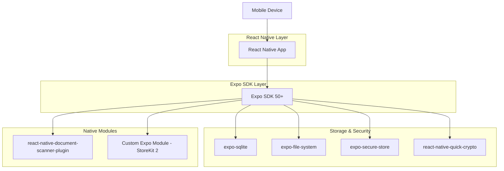

## 1. Architecture Design



## 2. Technology Description

- **Framework**: React Native (Expo SDK 50+)
- **Language**: TypeScript + Swift (Native Modules)
- **Platform**: Cross-Platform Mobile (iOS Primary, Android Secondary/Future)
- **Data Persistence**: expo-sqlite (Metadata), expo-file-system (Encrypted Blobs)
- **Encryption**: react-native-quick-crypto (AES-256-GCM)
- **Key Storage**: expo-secure-store (Keychain/Keystore)
- **Document Processing**: react-native-document-scanner-plugin (wraps VisionKit/MLKit)
- **In-App Purchases**: Custom Expo Module (Swift) wrapping StoreKit 2 APIs directly
- **File Management**: expo-file-system with custom encryption wrapper
- **Biometric Auth**: expo-local-authentication
- **Cloud Backup**: System Backup via Share Sheet (user saves to their own cloud)
- **Recovery**: QR Code-based vault restoration
- **No External Dependencies**: Expo-managed workflow with custom native modules

## 3. App Structure & Navigation

| Screen | Purpose | Navigation Pattern |
|--------|---------|-------------------|
| Welcome | Initial user choice (Planning vs Import) | Stack Navigator |
| Vault Dashboard | Main document overview | Tab Navigator (Home) |
| Document Library | Browse/manage documents | Stack Navigator |
| Document Scanner | Camera-based document capture | Modal presentation |
| Family Backup Kit | Create encrypted family package | Stack Navigator |
| Survivor Import | Import family kit | Special flow |
| Settings | App configuration | Tab Navigator (Settings) |

## 4. Security Architecture

### 4.1 Key Derivation Flow
```
User Passcode/Biometric 
    ↓
Key Encryption Key (KEK) - Derived via PBKDF2
    ↓
Data Encryption Key (DEK) - Stored encrypted with KEK
    ↓
Document Encryption - AES-256-GCM with DEK
```

### 4.2 Master Key Storage
- **Primary**: Secure Enclave (devices with SEP)
- **Fallback**: Keychain with biometric protection
- **KEK**: Never stored, derived from user authentication
- **DEK**: Encrypted with KEK and stored in Keychain

### 4.3 File Encryption Process
1. Generate unique nonce for each file
2. Encrypt file content with AES-256-GCM
3. Store encrypted data + nonce + auth tag
4. Metadata encrypted separately with same DEK
5. All operations happen on-device, never in cloud

## 5. Data Models

### 5.1 Core Entities (SwiftData)
```swift
@Model
class Vault {
    @Attribute(.unique) var id: UUID
    var name: String
    var ownerName: String?
    var createdAt: Date
    var updatedAt: Date
    var isActive: Bool
    var vaultType: VaultType // personal, family, parent, partner, etc.
    var items: [VaultItem]
    var familyKit: FamilyKit?
    var recoveryKit: RecoveryKit?
    var encryptionKey: String // Encrypted key reference
}

enum VaultType: String, Codable {
    case personal
    case family
    case parent
    case partner
    case child
    case other
}

@Model
class VaultItem {
    @Attribute(.unique) var id: UUID
    var vaultId: UUID // Foreign key to Vault
    var name: String
    var documentType: DocumentType
    var issueDate: Date?
    var expiryDate: Date?
    var providerName: String?
    var originalLocation: String?
    var encryptedFilePath: String
    var thumbnailPath: String?
    var tags: [String]
    var createdAt: Date
    var updatedAt: Date
    var bodyText: String? // For Personal Messages (v1 text-only)
}

enum AlertType: String, Codable {
    case gentle    // Standard reminders - no urgency language
    case urgent    // 14-day expiry - amber styling
    case emergency // No Family Kit Created - red styling (only true emergency)
}

struct KeepItCurrentAlert: Identifiable, Codable {
    let id: UUID
    let documentId: UUID
    let documentName: String
    let documentType: DocumentType
    let issueDate: Date?
    let expiryDate: Date?
    let alertType: AlertType
    let message: String
    let actionText: String
    let isDismissible: Bool
    let createdAt: Date
    
    // Gentle reminder examples:
    // "Your passport scan is from 2019. If it's been renewed, tap to update it."
    // 
    // Urgent (14 days) examples:
    // "Your life insurance policy expires 14 Mar. Tap to update."
    //
    // Emergency (only for No Family Kit):
    // "Your vault has no safety net yet" - persistent until resolved
}

enum DocumentType: String, Codable {
    case identity, legal, property, finance, insurance, medical, digital, personal, message // FINAL: 8 Categories confirmed
    
    static let suggestedDocuments: [DocumentType: [String]] = [
        .identity: ["Passport", "Driver's License", "Birth Certificate", "SSN Card"],
        .legal: ["Will", "Power of Attorney", "Trust Documents", "Marriage Certificate"],
        .property: ["Deeds", "Mortgage", "Rental Agreements", "Land Registry"],
        .finance: ["Bank Accounts", "Investments", "Pension", "Savings"],
        .insurance: ["Life Insurance", "Health Insurance", "Home Insurance", "Car Insurance"],
        .medical: ["Medical History", "Advance Directive", "Organ Donor Card"],
        .digital: ["Password Hints", "Email Accounts", "Subscriptions", "Crypto Wallets"],
        .personal: ["Letters", "Photos", "Voice Messages", "Final Wishes"],
        .message: ["Text Messages"] // v1: text-only, v2: voice/video with feature flag
    ]
    
    var keyDocumentCount: Int {
        return DocumentType.suggestedDocuments[self]?.count ?? 3
    }
}
```

### 5.2 Vault Manager & Multi-Vault Support
```swift
@MainActor
class VaultManager: ObservableObject {
    @Published var currentVault: Vault?
    @Published var availableVaults: [Vault] = []
    
    func createVault(name: String, type: VaultType) throws -> Vault
    func switchVault(to vaultId: UUID) throws
    func deleteVault(vaultId: UUID) throws
    func getVaultUsage() -> VaultUsageStats
    func canCreateMoreVaults() -> Bool // Family plan check
}

struct VaultUsageStats {
    let totalVaults: Int
    let maxVaults: Int // 1 for Personal, 5 for Family
    let documentsPerVault: [UUID: Int]
    let totalStorageUsed: Int64
}
```

### 5.3 Family Kit Structure
```swift
struct FamilyKit {
    let encryptedVault: Data        // .afterme file
    let accessKey: String          // QR code content
    let instructions: String         // Human-readable instructions
    let createdAt: Date
    let kitVersion: String
    let vaultId: UUID              // Reference to specific vault
}
```

## 6. .afterme Open Container Format (Trust Architecture)

### 6.1 File Structure Specification
```
afterme_vault_v1/
├── README.txt              # Plain English decryption instructions
├── manifest.json           # Metadata: version, date, document list
├── vault.enc               # AES-256-GCM encrypted ZIP of all documents
└── key.enc                 # Encrypted key (decryptable by QR code)
```

**CRITICAL**: Write the `.afterme` format spec before implementing encryption code. Once spec'd publicly, encryption implementation becomes constrained and consistent - cannot accidentally change format later without breaking existing kits.

### 6.2 README.txt Contents (Every Kit Contains This)
```
This file can be opened with the After Me app, OR decrypted manually using any AES-256-GCM tool with the key from your QR code. You do not need After Me to exist as a company to access these documents.

Manual Decryption Instructions:
1. Extract the vault.enc file
2. Use your QR code key with AES-256-GCM decryption
3. The result will be a ZIP file containing all documents

For detailed instructions, visit: https://afterme.app/format-spec
```

### 6.3 Technical Encryption Details
- **QR Code Key**: base58-encoded 256-bit random key
- **Vault Encryption**: AES-256-GCM with authenticated encryption
- **Key Storage**: Apple Secure Enclave (on device)
- **Family Kit Key**: Separate derived key embedded in QR code
- **Architecture**: Zero-knowledge, no server involvement

### 6.4 Open Source Decoder
- **Public GitHub Repository**: https://github.com/afterme/decoder
- **Python Script**: 100-line open-source tool to decrypt .afterme files
- **Command Line Usage**: `python decoder.py --key YOUR_QR_KEY --file vault.enc`
- **No Dependencies**: Pure Python with standard crypto libraries
- **Trust Signal**: Published format specification and working decoder

### 6.5 Format Specification Publication
- **Website**: https://afterme.app/format-spec
- **One-page document**: Complete technical specification
- **App Store Link**: Direct link from app description
- **Version Control**: GitHub repository with format history
- **Community Review**: Open for security audits and contributions

### 6.6 Zero Vendor Lock-in Guarantee
**Marketing Promise**: "Even if After Me shuts down tomorrow, your family can still open your vault. We publish the format. We publish the decoder. Your documents belong to you, not to us."

**Technical Implementation**:
- Documented, auditable format
- Open-source decryption tools
- No proprietary dependencies
- Industry-standard encryption (AES-256-GCM)
- Plain English instructions in every file

## 9. UI/UX Architecture & Design System

### 9.1 Visual Identity System

**Brand Principle**: "After Me should feel like finding a well-organized box of important papers in a loved one's handwriting — not like logging into a bank."

**Color Palette**:
- **Primary**: Warm Slate (#2D3142) - Human, serious, trustworthy without bank-lobby coldness
- **Accent**: Warm Amber-Gold (#C9963A) - Candlelight warmth, not metallic bank vault
- **Background**: Warm Off-White (#FAF9F6) - Paper-like, intentional, like a personal letter
- **Text**: Warm Slate (#2D3142) for headings, Dark Gray (#333333) for body text
- **Success**: Warm Green (#7A8471) - Natural, organic feel
- **Error**: Warm Red (#A94442) - Reserved ONLY for "No Family Kit Created" emergency state
- **Urgent**: Warm Amber (#D4A017) - Used for 14-day expiry alerts (life insurance, etc.)

**Typography**:
- **Display/Headings**: New York (Apple's humanist serif font) - feels like handwriting, like a letter to family
  - Implementation: `Font.custom("New York", size: 28)` or `Font.system(size: 28, design: .serif)`
- **Body Text**: SF Pro - legibility first, clean and modern
  - Implementation: `Font.system(size: 17, design: .default)`
- **Captions/Labels**: SF Pro Text - smaller sizes for secondary information

**Component Styling**:
- **Buttons**: Rounded rectangles (12px radius) with subtle paper-texture feel
- **Cards**: Soft shadows (0px 2px 8px rgba(45, 49, 66, 0.08)) with 1px warm slate border
- **Icons**: SF Symbols with warm slate tint, custom envelope/document icons that feel personal
- **Spacing**: Generous white space (16px+ margins) to create intentional, paper-like breathing room

### 9.2 MVVM Pattern
```swift
// ViewModel example
@MainActor
class VaultDashboardViewModel: ObservableObject {
    @Published var items: [VaultItem] = []
    @Published var isLoading = false
    @Published var keepItCurrentAlerts: [KeepItCurrentAlert] = []
    
    private let dataService: VaultDataService
    private let cryptoService: CryptoService
}
```

### 7.2 Navigation Pattern
- **SwiftUI NavigationStack**: For hierarchical navigation
- **Sheet Presentation**: For modal tasks (scanning, sharing)
- **TabView**: For main app sections
- **Programmatic Navigation**: For survivor import flow

### 7.3 State Management
- **@Published properties**: For view state
- **@AppStorage**: For user preferences
- **Combine publishers**: For async operations
- **@StateObject**: For view-specific state

## 8. CloudKit Integration (Zero-Knowledge)

### 8.1 Encrypted Backup Architecture
```
Local Vault Data
    ↓
AES-256-GCM Encryption (on-device)
    ↓
Encrypted Container (.afterme format)
    ↓
CloudKit Private Database
    ↓
Zero-Knowledge Sync (keys never leave device)
```

### 8.2 System Backup Architecture (Share Sheet)
- **User-Controlled**: User saves encrypted `.afterme` file to their preferred cloud (iCloud Drive/Google Drive/Dropbox)
- **Share Sheet Integration**: Native iOS/Android share functionality
- **File Format**: `.afterme` container with AES-256-GCM encryption
- **Restoration**: Import `.afterme` file via Share Sheet on new device
- **No Cloud Dependencies**: App doesn't manage cloud storage - users control their own backup locations

### 8.3 Recovery Kit Implementation
```swift
struct RecoveryKit {
    let vaultExportKey: String          // Base64 encoded encryption key
    let qrCode: Data                    // Generated QR code image
    let restorationInstructions: String // Step-by-step recovery guide
    let kitVersion: String              // Format version for compatibility
    let creationDate: Date              // For validation
}
```

### 8.4 Restoration Process
1. **QR Code Scanning**: Vision framework reads recovery key
2. **Key Validation**: Verify key format and checksum
3. **Vault Decryption**: Use recovery key to decrypt .afterme file
4. **Data Import**: Restore all documents and metadata
5. **Biometric Setup**: Require new biometric authentication

## 9. Security Implementation Details

### 8.1 Biometric Authentication
```swift
func authenticateUser() async throws {
    let context = LAContext()
    context.localizedReason = "Access your secure vault"
    context.localizedFallbackTitle = "Use Passcode"
    
    let success = try await context.evaluatePolicy(
        .deviceOwnerAuthenticationWithBiometrics,
        localizedReason: "Access your secure vault"
    )
    
    if success {
        deriveEncryptionKeys()
    }
}
```

### 8.2 Document Encryption Service
```swift
class CryptoService {
    func encryptFile(_ data: Data, with key: SymmetricKey) throws -> EncryptedFile {
        let nonce = AES.GCM.Nonce()
        let sealedBox = try AES.GCM.seal(data, using: key, nonce: nonce)
        
        return EncryptedFile(
            ciphertext: sealedBox.ciphertext,
            nonce: sealedBox.nonce,
            tag: sealedBox.tag
        )
    }
}
```

## 9. Local-First Constraints

### 9.1 Network & CloudKit Dependencies
- **Optional CloudKit**: User-controlled encrypted backup (opt-in only)
- **Zero-knowledge encryption**: All encryption happens on-device before CloudKit
- **Offline-first**: Core functionality works without network
- **No analytics**: No tracking or telemetry ever
- **CloudKit only**: No other external services or APIs

### 10.2 Local-First with Optional Cloud Backup
- **Primary Storage**: Local encrypted files (works offline)
- **CloudKit Role**: Encrypted backup bucket only - no business logic
- **Key Control**: Encryption keys never leave Secure Enclave
- **Privacy Guarantee**: Apple cannot access decrypted data
- **User Control**: Can disable CloudKit sync at any time

### 9.2 Feature Flags for Future Development

```swift
enum FeatureFlags {
    static let voiceVideoMessages = false // v2: Enable voice/video recording
    static let messageStorageLimitMB = 500 // v2: 500MB total for voice/video messages
    static let maxMessageDurationMinutes = 5 // v2: 3-5 minutes per voice/video message
    static let maxVaults = 1 // Personal: 1, Family: 5 - controlled by purchase tier
    static let multiVaultSupport = true // Enable vault switching UI
}
```

### 9.3 Multi-Vault UI Architecture
```swift
// Vault Switcher Component
struct VaultSwitcherView: View {
    @ObservedObject var vaultManager: VaultManager
    @State private var showingVaultSelector = false
    
    var body: some View {
        HStack {
            Text(vaultManager.currentVault?.name ?? "My Vault")
                .font(.headline)
            Image(systemName: "chevron.down")
                .font(.caption)
        }
        .onTapGesture { showingVaultSelector = true }
        .sheet(isPresented: $showingVaultSelector) {
            VaultSelectorView(vaultManager: vaultManager)
        }
    }
}

// Vault Creation Flow
struct CreateVaultView: View {
    @State private var vaultName = ""
    @State private var vaultType: VaultType = .personal
    @State private var ownerName = ""
    
    var body: some View {
        NavigationStack {
            Form {
                Section("Vault Details") {
                    TextField("Vault Name", text: $vaultName)
                    TextField("Owner Name", text: $ownerName)
                }
                
                Section("Vault Type") {
                    Picker("Type", selection: $vaultType) {
                        Text("Personal").tag(VaultType.personal)
                        Text("Parent").tag(VaultType.parent)
                        Text("Partner").tag(VaultType.partner)
                        Text("Other").tag(VaultType.other)
                    }
                    .pickerStyle(.segmented)
                }
            }
            .navigationTitle("Create Vault")
            .toolbar {
                ToolbarItem(placement: .confirmationAction) {
                    Button("Create") {
                        // Create vault logic
                    }
                    .disabled(vaultName.isEmpty)
                }
            }
        }
    }
}
```

### 9.3 Data Portability
- Export as encrypted .afterme files
- Import on any iOS device with app
- No vendor lock-in
- Human-readable backup instructions

### 9.3 Privacy Guarantees
- Zero-knowledge architecture
- No data leaves device unencrypted
- No server-side processing
- Complete user control over data