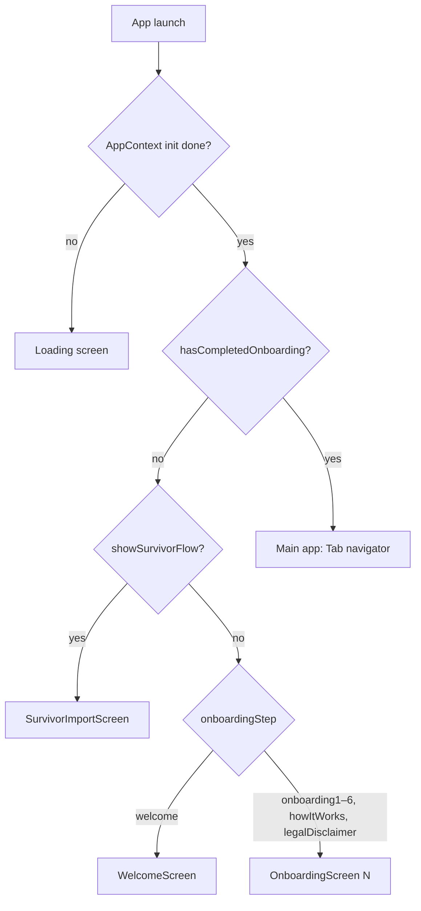
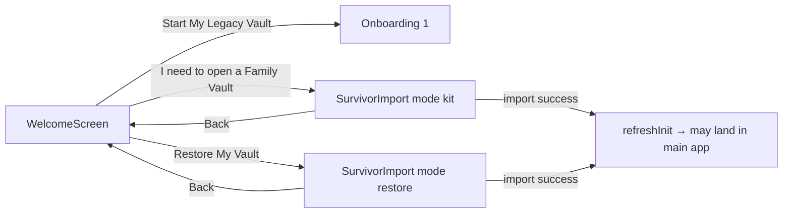
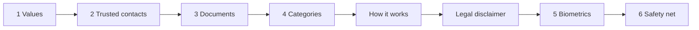
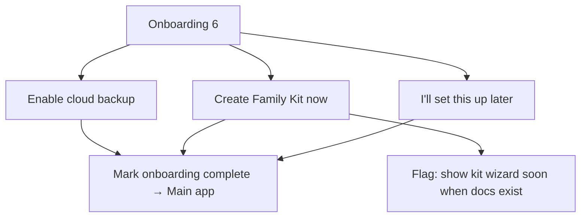
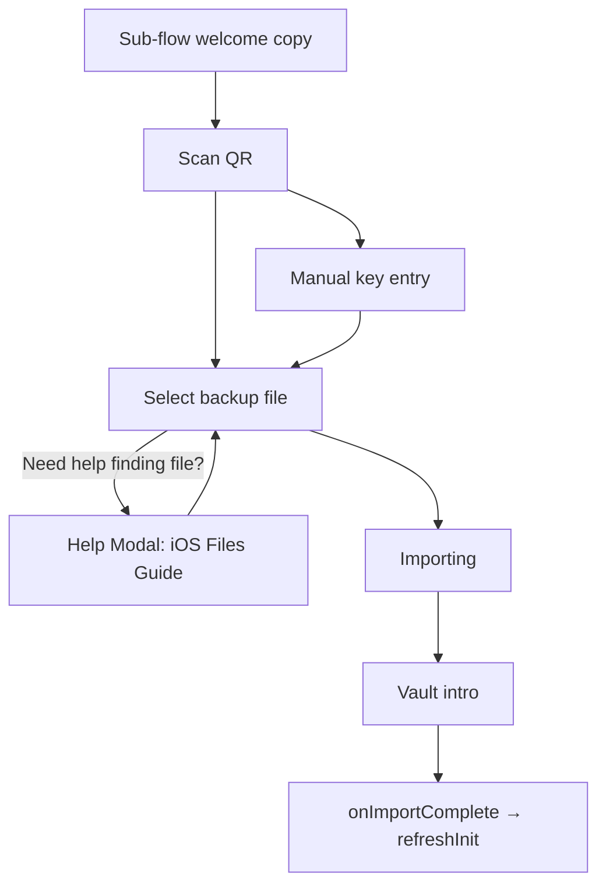
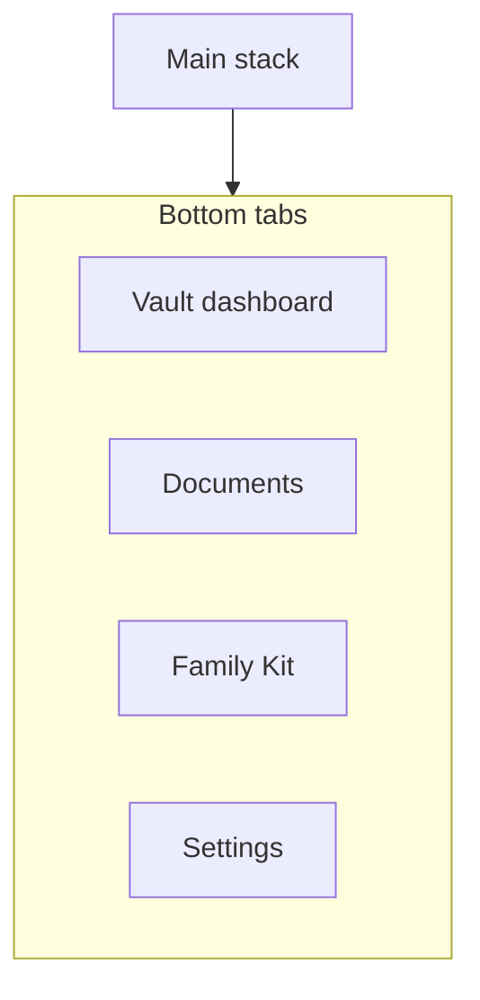

# After Me — user journey & routes (Updated for UX Rework)

This document reflects the **updated app navigation and UX copy** in `after-me-mobile` following the UI/UX Rework for accessibility, clarity, and trust.

---

## 1. Cold start → first meaningful screen

---

## 2. Welcome — three entry paths (Updated Copy)

The Welcome screen has been updated for extreme clarity, removing marketing jargon.

---

## 3. “Start My Legacy Vault” — linear onboarding

---

## 4. Onboarding 6 — safety net outcomes

---

## 5. Survivor / import flow (With Contextual Help)

This flow now includes a specific Help branch for users struggling to find the `.afterme` file in the iOS file system.

---

## 6. Main app — bottom tabs

---

## 7. Dynamic Progress & Tiers (New UX Logic)

The Vault Dashboard and Document Library now dynamically alter their UI based on the user's subscription tier to maintain honesty and prevent bait-and-switch friction.

*   **Free Tier:** Dashboard target is `5`. UI shows "X of 5 essential documents". Empty states act as direct buttons to add documents.
*   **Premium Tier:** Dashboard target expands to `24`. UI shows "X of 24 key documents". 
