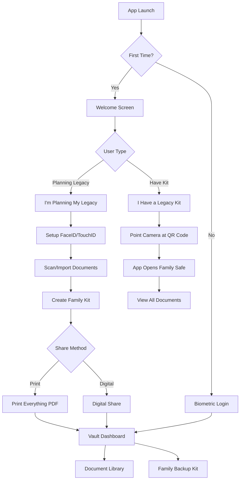

## 1. Product Overview

**After Me** is a secure, local-first digital vault application designed for end-of-life planning. Unlike cloud-based solutions, all documents are encrypted and stored locally on the device, ensuring complete privacy and zero-knowledge architecture. The app solves the critical problem of document access after death through its "Family Backup Kit" - users create a simple family package while alive.

The target market includes adults 35+ who want complete control over their sensitive documents while ensuring family access after death. This local-first approach provides maximum security and privacy for estate planning documents. The name "After Me" is intentionally direct and thought-provoking - it forces users to confront mortality while offering a practical solution.

## 2. Core Features

### 2.1 User Roles

| Role                       | Registration Method                                  | Core Permissions                                                                     |
| -------------------------- | ---------------------------------------------------- | ------------------------------------------------------------------------------------ |
| Vault Owner                | Apple ID + Biometric Setup (FaceID/TouchID/Passcode) | Full access to all documents, can create encrypted vault files, generate access keys |
| Trusted Contact (Survivor) | No app registration required                         | Can import encrypted vault file and decrypt using QR code key                        |
| Legacy Executor            | Manual setup by vault owner                          | Receives encrypted vault file and access key, can access all documents after import  |

### 2.2 Feature Module

**After Me** consists of the following main screens:

1. **Welcome Screen**: Two huge buttons - "I'm Planning My Legacy" or "I Have a Legacy Kit".
2. **Vault Dashboard**: Local document overview with categories, expiry alerts, and Family Backup Kit creation.
3. **Document Library**: Local encrypted storage with smart scanning and import capabilities.
4. **Family Backup Kit**: One-tap wizard to create family package with print or digital share options.
5. **Document Scanner**: Built-in VisionKit scanner with edge detection, auto-crop, and enhancement.
6. **Settings**: Biometric authentication and basic app settings.

### 2.3 Page Details

| Page Name         | Module Name         | Feature description                                                                                                      |
| ----------------- | ------------------- | ------------------------------------------------------------------------------------------------------------------------ |
| Vault Dashboard   | Document Overview   | Display local encrypted document counts by category, show system-added dates and user-set expiry alerts                  |
| Vault Dashboard   | Vault Actions       | Create encrypted backup file, generate access key QR code, view vault file location                                      |
| Document Library  | Smart Scanner       | VisionKit integration with edge detection, auto-crop, perspective correction, and image enhancement                      |
| Document Library  | Import Methods      | Drag & drop from other iOS apps, import from Files app, import from Photo Library                                        |
| Document Library  | Document Metadata   | Set Document Date (issue date), Expiry Date (for alerts), Provider/Issuer Name, Location of Original (physical location) |
| Document Library  | Local Viewer        | Decrypt and view documents locally, built-in PDF/image viewer with zoom and annotation                                   |
| Family Backup Kit | Create Family Kit   | One-tap button creates locked family package with all documents and family key                                           |
| Family Backup Kit | Print Everything    | Generate PDF with instructions, QR code, and where to find the family package                                            |
| Family Backup Kit | Digital Share       | Use iOS Share Sheet to send `.afterme` file and separate "Key Card" image                                                |
| Survivor Import   | I Have a Kit        | Special onboarding for family members who received a legacy kit                                                          |
| Survivor Import   | Scan Family Key     | Point camera at QR code - app handles finding file and opening the safe                                                  |
| Settings          | Biometric Auth      | FaceID/TouchID/Passcode ONLY (no app-specific passwords), configure fallback options                                     |
| Settings          | Encryption Settings | View AES-256 GCM encryption status, key storage in Secure Enclave confirmation                                           |

## 3. Core Process

**Vault Owner Flow (While Alive):**

1. Download app and tap "I'm Planning My Legacy"
2. Set up FaceID/TouchID (no passwords to remember)
3. Scan/import documents using camera or drag & drop
4. Tap "Create Family Kit" - one button does everything
5. Choose how to give it to family: "Print Everything" or "Digital Share"
6. If printing: App creates PDF with instructions and QR code
7. If sharing: App sends file and Key Card image to chosen contact
8. Done - family has everything they need

**Survivor Flow (After Death):**

1. Download **After Me** app on any device
2. Tap "I Have a Legacy Kit" on welcome screen
3. Point camera at the QR code (from printed paper or photo)
4. App automatically finds the family package and opens the safe
5. Immediate access to all documents and information
6. View everything with built-in viewer - no technical knowledge needed

## 4. User Interface Design

### 4.1 Design Style

* **Primary Colors**: Deep navy blue (#1B365D) for trust/security, warm gold (#D4AF37) for premium feel

* **Secondary Colors**: Soft gray (#F5F5F5) backgrounds, white cards, red (#E74C3C) for alerts

* **Button Style**: Rounded rectangles with subtle shadows, primary actions in gold, secondary in outline style

* **Typography**: SF Pro Display for headers (bold), SF Pro Text for body, consistent with iOS design

* **Layout**: Card-based design with clear visual hierarchy, generous white space for readability

* **Icons**: SF Symbols for consistency, custom vault/shield icons for security elements

### 4.2 Page Design Overview

| Page Name         | Module Name         | UI Elements                                                                      |
| ----------------- | ------------------- | -------------------------------------------------------------------------------- |
| Vault Dashboard   | Header              | User greeting, biometric lock indicator, settings gear icon in top-right         |
| Vault Dashboard   | Document Cards      | Horizontal scrolling category cards with document counts and progress indicators |
| Vault Dashboard   | Alert Section       | Red banner for urgent expiries (30 days), amber for 90 days, swipe to dismiss    |
| Document Library  | Search Bar          | Prominent search with filter pills for categories, recent searches               |
| Document Library  | Document Grid       | 2-column grid of document thumbnails, long-press for actions menu                |
| Trusted Contacts  | Contact List        | iOS-style table view with contact photos, access level badges, swipe actions     |
| Legacy Settings   | Toggle Switches     | iOS standard toggles for break-glass, inactivity alerts, with explanatory text   |
| Personal Messages | Recording Interface | Large record button with timer, preview thumbnail, send/save options             |

### 4.3 Responsiveness

* Native iOS app designed specifically for iPhone and iPad

* Adaptive layouts for different screen sizes (iPhone SE to iPad Pro)

* Portrait and landscape orientation support

* Optimized for one-handed use on larger iPhones

* Accessibility features: Dynamic Type, VoiceOver, Switch Control support

### 4.4 Security & Privacy Design

* Zero-knowledge architecture - developers cannot access user data

* Client-side AES-256 encryption before any data leaves device

* Biometric authentication required for app access

* Optional additional passcode for sensitive documents

* Secure enclave for cryptographic operations on supported devices

* No analytics or tracking of document content

* Local-first architecture with optional encrypted CloudKit sync

## 5. Monetization Strategy

### 5.1 Business Model: Freemium with 7-Day Full Trial

**Trial Period**: 7 Days of unrestricted access
- Add unlimited documents
- Create Family Kit
- Full app functionality

**Post-Trial (Free Tier)**: Read-Only mode
- View existing documents
- Export existing data
- Cannot add new documents
- Cannot edit metadata

**Premium Unlock (Lifetime)**: One-time In-App Purchase ($49.99)
- Unlimited adding/editing forever
- No subscriptions
- One-time payment for permanent access

### 5.2 Rationale

**Trust Building**: Users need to experience the security and ease of use before committing to payment. The 7-day trial provides sufficient time to scan documents, create a Family Kit, and understand the value proposition.

**Data Safety**: Even if users don't pay, they never lose access to their already-stored documents. This read-only access builds immense trust and ensures users feel secure about their data investment.

**Market Differentiation**: "No Subscription" is the primary marketing hook against competitors who typically require ongoing monthly fees. The one-time purchase model appeals to users who dislike recurring charges.
