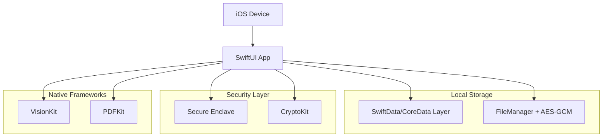

## 1. Architecture Design



## 2. Technology Description

- **Platform**: iOS 17+ (SwiftUI 5.0+)
- **Architecture**: MVVM with SwiftUI Combine
- **Data Persistence**: SwiftData (iOS 17+) / CoreData (fallback)
- **Encryption**: CryptoKit (AES-256-GCM)
- **Key Storage**: Secure Enclave / Keychain
- **Document Processing**: VisionKit (scanning), PDFKit (viewing)
- **File Management**: FileManager with custom encryption wrapper
- **Biometric Auth**: LocalAuthentication framework
- **No External Dependencies**: 100% native Apple frameworks

## 3. App Structure & Navigation

| Screen | Purpose | Navigation Pattern |
|--------|---------|-------------------|
| Welcome | Initial user choice (Planning vs Import) | Full-screen modal |
| Vault Dashboard | Main document overview | Root navigation |
| Document Library | Browse/manage documents | NavigationStack push |
| Document Scanner | Camera-based document capture | Sheet presentation |
| Family Backup Kit | Create encrypted family package | NavigationStack push |
| Survivor Import | Import family kit | Special flow |
| Settings | App configuration | Tab-based |

## 4. Security Architecture

### 4.1 Key Derivation Flow
```
User Passcode/Biometric 
    ↓
Key Encryption Key (KEK) - Derived via PBKDF2
    ↓
Data Encryption Key (DEK) - Stored encrypted with KEK
    ↓
Document Encryption - AES-256-GCM with DEK
```

### 4.2 Master Key Storage
- **Primary**: Secure Enclave (devices with SEP)
- **Fallback**: Keychain with biometric protection
- **KEK**: Never stored, derived from user authentication
- **DEK**: Encrypted with KEK and stored in Keychain

### 4.3 File Encryption Process
1. Generate unique nonce for each file
2. Encrypt file content with AES-256-GCM
3. Store encrypted data + nonce + auth tag
4. Metadata encrypted separately with same DEK
5. All operations happen on-device, never in cloud

## 5. Data Models

### 5.1 Core Entities (SwiftData)
```swift
@Model
class VaultItem {
    @Attribute(.unique) var id: UUID
    var name: String
    var documentType: DocumentType
    var issueDate: Date?
    var expiryDate: Date?
    var providerName: String?
    var originalLocation: String?
    var encryptedFilePath: String
    var thumbnailPath: String?
    var tags: [String]
    var createdAt: Date
    var updatedAt: Date
}

enum DocumentType: String, Codable {
    case will, insurance, property, medical, financial, personal, other
}
```

### 5.2 Family Kit Structure
```swift
struct FamilyKit {
    let encryptedVault: Data        // .afterme file
    let accessKey: String          // QR code content
    let instructions: String         // Human-readable instructions
    let createdAt: Date
    let kitVersion: String
}
```

## 6. Export Format (.afterme)

### 6.1 File Structure
```
.afterme file (Encrypted ZIP-like container)
├── manifest.json (encrypted)
├── documents/
│   ├── doc1.pdf (encrypted)
│   ├── doc2.jpg (encrypted)
│   └── thumbnails/
├── metadata/
│   └── vault_items.json (encrypted)
└── kit_info/
    └── creation_info.json (encrypted)
```

### 6.2 Encryption Details
- **Container**: AES-256-GCM encryption
- **Key**: Derived from family access key
- **Authentication**: HMAC-SHA256 for integrity
- **Compression**: DEFLATE before encryption

## 7. UI/UX Architecture

### 7.1 MVVM Pattern
```swift
// ViewModel example
@MainActor
class VaultDashboardViewModel: ObservableObject {
    @Published var items: [VaultItem] = []
    @Published var isLoading = false
    @Published var alerts: [ExpiryAlert] = []
    
    private let dataService: VaultDataService
    private let cryptoService: CryptoService
}
```

### 7.2 Navigation Pattern
- **SwiftUI NavigationStack**: For hierarchical navigation
- **Sheet Presentation**: For modal tasks (scanning, sharing)
- **TabView**: For main app sections
- **Programmatic Navigation**: For survivor import flow

### 7.3 State Management
- **@Published properties**: For view state
- **@AppStorage**: For user preferences
- **Combine publishers**: For async operations
- **@StateObject**: For view-specific state

## 8. Security Implementation Details

### 8.1 Biometric Authentication
```swift
func authenticateUser() async throws {
    let context = LAContext()
    context.localizedReason = "Access your secure vault"
    context.localizedFallbackTitle = "Enter Passcode"
    
    let success = try await context.evaluatePolicy(
        .deviceOwnerAuthenticationWithBiometrics,
        localizedReason: "Access your secure vault"
    )
    
    if success {
        deriveEncryptionKeys()
    }
}

// Biometric Fallback Logic (Phase 1 - Defined Now)
// After 5 consecutive Face ID failures:
// 1. Fallback to device passcode (LAContext.localizedFallbackTitle = "Enter Passcode")
// 2. If passcode also fails or is disabled: app wipes local encryption keys
// 3. This is aggressive but standard for high-security vaults
// 4. User must restore from backup or recreate vault
```

### 8.2 Document Encryption Service
```swift
class CryptoService {
    func encryptFile(_ data: Data, with key: SymmetricKey) throws -> EncryptedFile {
        let nonce = AES.GCM.Nonce()
        let sealedBox = try AES.GCM.seal(data, using: key, nonce: nonce)
        
        return EncryptedFile(
            ciphertext: sealedBox.ciphertext,
            nonce: sealedBox.nonce,
            tag: sealedBox.tag
        )
    }
}
```

## 9. Local-First Constraints

### 9.1 No Network Dependencies
- All encryption/decryption on-device
- No cloud storage or sync
- No analytics or tracking
- No external API calls
- Works completely offline

### 9.2 Data Portability
- Export as encrypted .afterme files
- Import on any iOS device with app
- No vendor lock-in
- Human-readable backup instructions

### 9.3 Privacy Guarantees
- Zero-knowledge architecture
- No data leaves device unencrypted
- No server-side processing
- Complete user control over data
